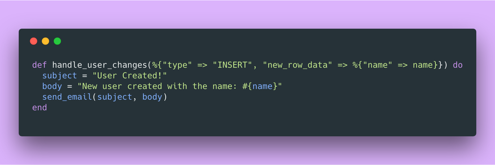
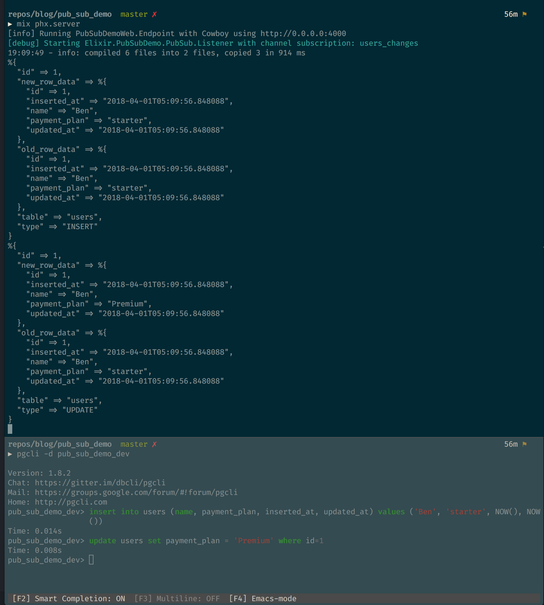
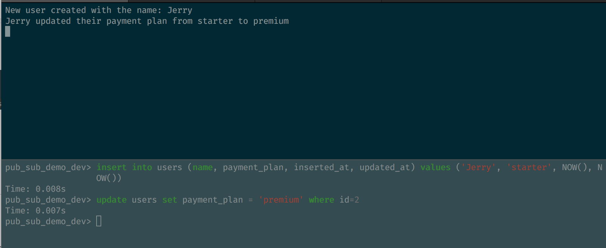
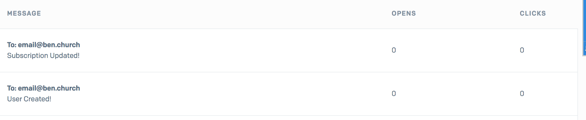

A lot of time you need to make a system that can send out **notifications** to yourself or other users **based on events**, specifically events related to changes in your database. **Postgres** and **Phoenix** make this ridiculously easy.

By the end of this **short** post you will have:

1.  Setup a Phoenix 1.3 project
2.  Setup a broadcast function and trigger in Postgres
3.  Used a GenServer to listen for broadcasts from Postgres
4.  Used Bamboo to send emails to yourself when users signs up or changes their payment plan.

### Getting Setup

#### Before you start

Please make sure you have the following installed and/or ready to go:

1.  [Elixir](https://elixir-lang.org/install.html)
2.  [Phoenix](https://hexdocs.pm/phoenix/installation.html)
3.  [PostgreSQL](https://www.postgresql.org/download/)
4.  A valid [SendGrid](http://www.sendgrid.com) account

#### Initialize the project

Lets create a new Phoenix 1.3 project called `pub_sub_demo`

```bash
mix phx.new pub_sub_demo

cd pub_sub_demo

mix ecto.create
```

#### Add Two Additional Dependencies

Next we want to add `HTTPoison` to help with decoding strings sent from the database and `Bamboo` to help us send emails.

To do this in your `mix.exs` file add the following to your `deps`:

```elixir
{:httpoison, "~> 1.0"},
{:bamboo, "~> 0.8"}
```

Also update the `extra_applications` section to include `:bamboo`

```elixir
extra_applications: [:logger, :runtime_tools, :bamboo]
```

#### Create a model

Finally lets create the `User` model we will be using to show off all of this broadcasting goodness.

```bash
mix phx.gen.context Accounts User users name:string payment_plan:string
```

_Note: We created the_ `_User_` _in a new context called_ `_Accounts_`_. If you are unfamiliar with contexts they are nothing to be afraid of just a convention phoenix uses to group functionality. They are not special, just a way to bag functions together._

#### Kick it off!

Migrate the database, grab your dependencies and lets go!

```bash
mix ecto.migrate
mix deps.get
mix phx.server
```

_Note: You should now be able to navigate to_ `_localhost:4000_` _and see your application running. Though for the purposes of this demo you wont really be viewing any screens._

### Broadcast Changes with Postgres

The whole idea of this is for Postgres to let **_US_** know when things have changed. To do so we need to set up two things:

1.  A function that takes an action (`INSERT`, `UPDATE`, `DELETE`) performed on a row for the purpose of broadcasting it outside of the database.
2.  A trigger that calls this function when an action has occurred on a specific table.

#### Create the Ecto Migration

```bash
mix ecto.gen.migration broadcast_users_table_changes
```

#### Add the Function and Trigger

Update the migration file you created above to include the following

```elixir
# broadcast_changes_migration.ex
defmodule PubSubDemo.Repo.Migrations.BroadcastUsersTableChanges do
  use Ecto.Migration

  def up do
    # Create a function that broadcasts row changes
    execute "
      CREATE OR REPLACE FUNCTION broadcast_changes()
      RETURNS trigger AS $$
      DECLARE
        current_row RECORD;
      BEGIN
        IF (TG_OP = 'INSERT' OR TG_OP = 'UPDATE') THEN
          current_row := NEW;
        ELSE
          current_row := OLD;
        END IF;
        IF (TG_OP = 'INSERT') THEN
          OLD := NEW;
        END IF;
      PERFORM pg_notify(
          'users_changes',
          json_build_object(
            'table', TG_TABLE_NAME,
            'type', TG_OP,
            'id', current_row.id,
            'new_row_data', row_to_json(NEW),
            'old_row_data', row_to_json(OLD)
          )::text
        );
      RETURN current_row;
      END;
      $$ LANGUAGE plpgsql;"

    # Create a trigger links the users table to the broadcast function
    execute "
      CREATE TRIGGER notify_user_changes_trigger
      AFTER INSERT OR UPDATE OR DELETE
      ON users
      FOR EACH ROW
      EXECUTE PROCEDURE broadcast_changes();"
  end

  def down do
    execute "DROP TRIGGER notify_user_changes_trigger"
  end
end
```

_If you want to better understand what is occurring here check out this blog post by @kaisersly which largely is the inspiration for what you are reading here:_

[_https://medium.com/@kaisersly/postgrex-notifications-759574f5796e_](https://medium.com/@kaisersly/postgrex-notifications-759574f5796e)

### Listen for Changes

Now that we have our database broadcasting changes that occur on our `users` table we need to be able to listen and act on the same channel. Thankfully Postgrex provides this by default using `Postgrex.Notifications`.

To use this we must create a `GenServer` responsible for listening to `Postgrex` and acting on the messages broadcast.

#### Creating our GenServer

Create the file `lib/pub_sub_demo/pub_sub/listener.ex` and populate it with the following:

```elixir
# listener.ex
defmodule PubSubDemo.PubSub.Listener do
  use GenServer

  require Logger

  import Poison, only: [decode!: 1]

  @doc """
  Initialize the GenServer
  """
  @spec start_link([String.t], [any])  :: {:ok, pid}
  def start_link(channel, otp_opts \\ []), do: GenServer.start_link(__MODULE__, channel, otp_opts)

  @doc """
  When the GenServer starts subscribe to the given channel
  """
  @spec init([String.t])  :: {:ok, []}
  def init(channel) do
    Logger.debug("Starting #{ __MODULE__ } with channel subscription: #{channel}")
    pg_config = PubSubDemo.Repo.config()
    {:ok, pid} = Postgrex.Notifications.start_link(pg_config)
    {:ok, ref} = Postgrex.Notifications.listen(pid, channel)
    {:ok, {pid, channel, ref}}
  end

  @doc """
  Listen for changes
  """
  def handle_info({:notification, _pid, _ref, "users_changes", payload}, _state) do
    payload
    |> decode!()
    |> IO.inspect()

    {:noreply, :event_handled}
  end

  def handle_info(_, _state), do: {:noreply, :event_received}
end
```

For now all that this does is listen on a channel provided and log the messages broadcast to that channel.

Next lets configure this as a Worker and give it the channel it will listen to.

#### Hook up the listener

Update the `application.ex` file so that it starts the `Listener` we just defined with the appropriate `users_changes` channel.

```elixir
# application.ex
defmodule PubSubDemo.Application do
  use Application


  def start(_type, _args) do
    # ...
    children = [

      # ...

      # Start the listener
      worker(
        PubSubDemo.PubSub.Listener,
        ["users_changes", [name: PubSubDemo.PubSub.Listener]],
        restart: :permanent
      )
    ]
    # ...
  end
  # ...
end
```

#### See it in Action

You should now be able to start your application again by running:

```bash
mix ecto.migrate
mix phx.server
```

Then any change you make to the `users` table via Postgres’s CLI should be output to our Applications `stdout`.



### Listening for Specific Actions

While it’s nice to be able to see **_everything_**  that occurs in the database often we only care about a small subset of these changes. Specifically for this demo:

1.  User created
2.  User subscription updated

Luckily Elixir’s pattern matching provides a wonderfully simple way to cut down on all the noise and focus exactly on the shape of data you’re looking for.

What we want to do is update `handle_info` to send the payload to a function that will match on the events that matter.

```elixir
# listener.ex
@doc """
Listen for changes in the users table
"""
def handle_info({:notification, _pid, _ref, "users_changes", payload}, _state) do
  payload
  |> decode!()
  |> handle_user_changes()

  {:noreply, :event_handled}
end

def handle_info(_, _state), do: {:noreply, :event_received}

@doc """
Listen for new users and log when created
"""
def handle_user_changes(%{
  "type" => "INSERT",
  "new_row_data" => %{
    "name" => name
  }
}) do
  IO.puts("New user created with the name: #{name}")
end

@doc """
Listen and log when users change their payment plan
"""
def handle_user_changes(%{
  "type" => "UPDATE",
  "old_row_data" => %{
    "name" => old_name,
    "payment_plan" => old_payment_plan,
  },
  "new_row_data" => %{
    "name" => new_name,
    "payment_plan" => new_payment_plan,
  },
}) when old_payment_plan != new_payment_plan do
  IO.puts("#{new_name} updated their payment plan from #{old_payment_plan} to #{new_payment_plan}")
end

def handle_user_changes(payload), do: nil
```

The above only acts on only the exact events we are looking for and outputs a specific message to our log. Anything else is ignored.



### Link it up to an email service

Standard out is nice but in a running application you don’t want to be combing logs for events that your business cares about, you want to be notified in realtime.

Lets hook our messages up to an email provider so that we get a notification right in our inbox when a user signs up or upgrades their plan.

The `Bamboo` Elixir library and `Send Grid` service make this far too easy.

#### Setup Bamboo

Add the following to your `config.exs` file

```elixir
# Send emails using Sendgrid
config :pub_sub_demo, PubSubDemo.Mailer,
  adapter: Bamboo.SendgridAdapter,
  api_key: System.get_env("SENDGRID_API_KEY")

```

_Note: Bamboo offers many more adapters than just Send Grid if you have a different preference._ [_https://github.com/thoughtbot/bamboo#adapters_](https://github.com/thoughtbot/bamboo#adapters)

Create a `mailer.ex` file in your `pub_sub_demo` folder

```elixir
# mailer.ex
defmodule PubSubDemo.Mailer do
  use Bamboo.Mailer, otp_app: :pub_sub_demo
end

```

#### Sending emails from our Listener

Update `handle_user_changes` in `listener.ex` to send our log messages to our own email address.

```elixir
# listeners.ex
import Bamboo.Email

@doc """
Listen for new users and email when created
"""
def handle_user_changes(%{
  "type" => "INSERT",
  "new_row_data" => %{
    "name" => name
  }
}) do
  subject = "User Created!"
  body = "New user created with the name: #{name}"
  send_email(subject, body)
end

@doc """
Listen and email when users change their payment plan
"""
def handle_user_changes(%{
  "type" => "UPDATE",
  "old_row_data" => %{
    "name" => old_name,
    "payment_plan" => old_payment_plan,
  },
  "new_row_data" => %{
    "name" => new_name,
    "payment_plan" => new_payment_plan,
  },
}) when old_payment_plan != new_payment_plan do
  subject = "Subscription Updated!"
  body = "#{new_name} updated their payment plan from #{old_payment_plan} to #{new_payment_plan}"

  send_email(subject, body)
end

def handle_user_changes(payload), do: nil

def send_email(subject, body) do
  new_email(
    to: "email@ben.church",
    from: "support@myapp.com",
    subject: subject,
    html_body: "<strong>#{body}</strong>",
    text_body: body
  )
  |> PubSubDemo.Mailer.deliver_now()
end
```

### Run it for a Final Time

Now if you create or update a user in your `users` table you should see emails appear in your SendGrid logs.



Thats it!

### Conclusion

The concept of broadcasting events directly from your database isn’t something new and as a result this type of functionality is available to you in any language and framework.

But! The core features and functionality of Elixir and Phoenix make using database events much easier and more reasonable than I have found in any other system. Pattern Matching and OTP principles are both simple and powerful and I encourage anyone to take a deep dive into them when possible.


> 🧞‍ This is open source! you can [find it here on Github](https://github.com/bnchrch/pub_sub_demo)

> ❤️ I only write about programming and remote work. If you [follow me on Twitter](https://www.twitter.com/bnchrch) I won’t waste your time.