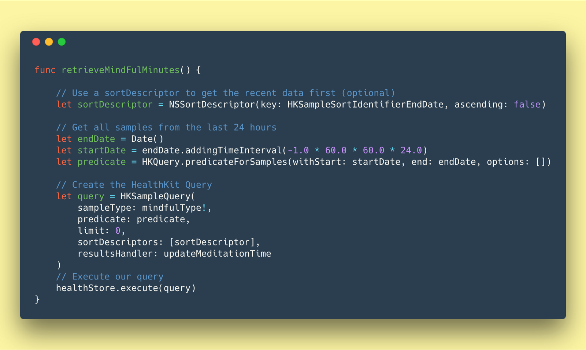
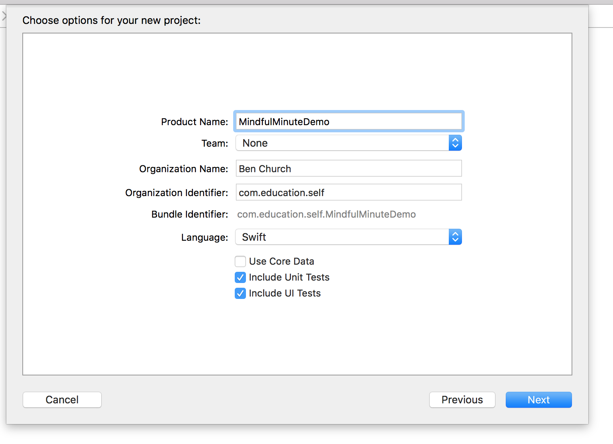
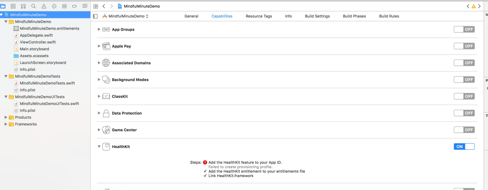
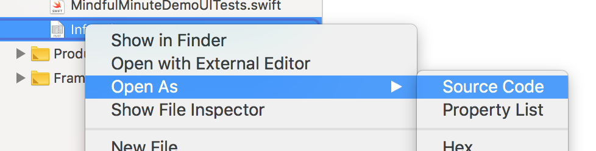
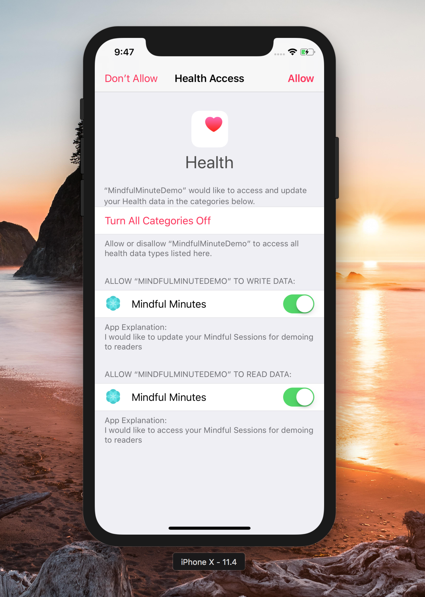
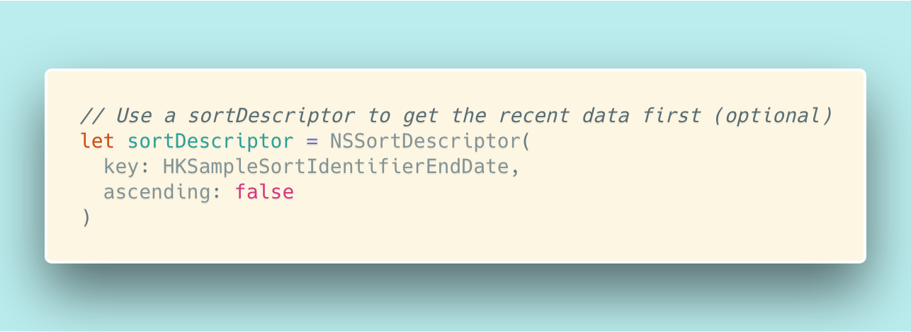
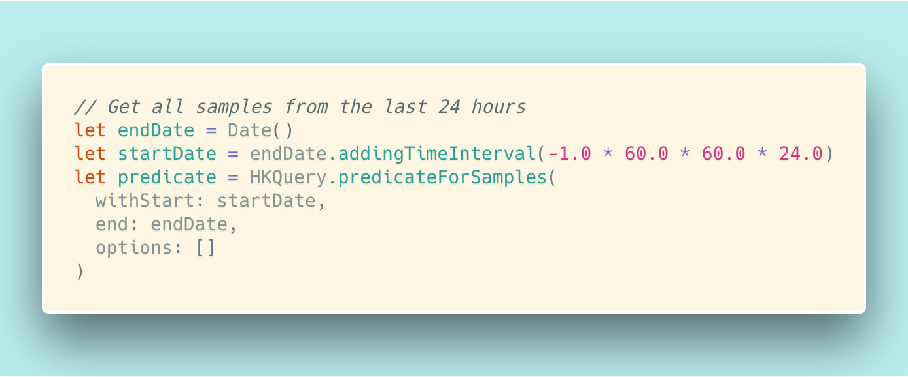
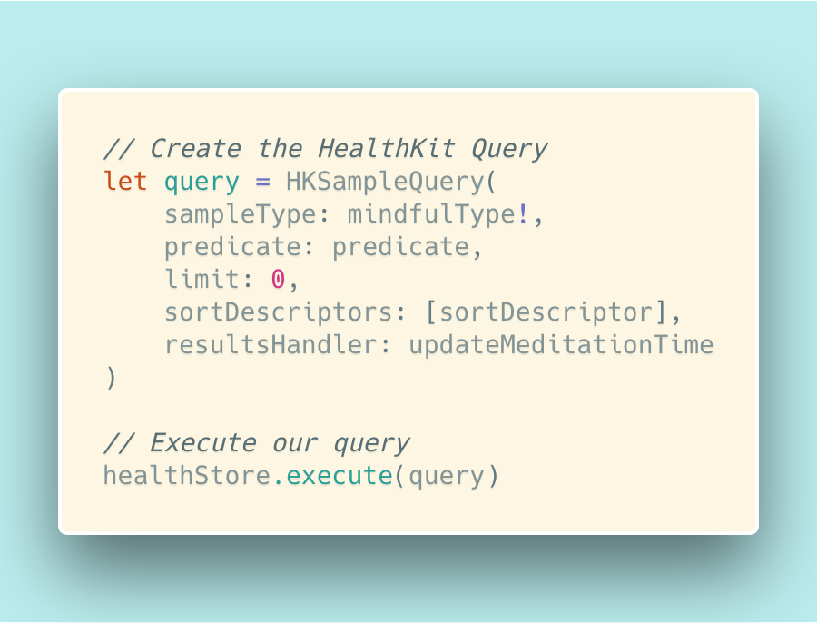

I took the time to figure out how to read and write from HealthKit so you don’t have to!



I absolutely love the route Apple has been going with their iOS SDK’s. ([Their hardware not so much](https://twitter.com/bnchrch/status/995519114318725120)). Apple’s [focus on security](https://www.theguardian.com/technology/2016/jun/15/apple-fbi-file-encryption-wwdc) has allowed it to become a reliable company to trust your sensitive information with. This has allowed iPhones to make headway as the device best suited to host medical data. As a result, they’re also the best device to make software that interfaces with a user’s sensitive personal info.

With this in mind, I believe it’s essential to know how to read and write from Apple’s HealthKit so that we as developers can leverage the position Apple has put itself in. So today’s tutorial is going to focus on **Reading and writing Mindful Minutes from Apple’s HealthKit**.

By the end of this tutorial, you will have learned how to:

-   Setup a basic iOS app
-   Request permission to read and write data from HealthKit
-   Read and query data from HealthKit
-   Write data back to HealthKit

Alright let’s jump into setting up the XCode Project. 🚀

### Setup the Skeleton

Every great project starts from the same screen (if you’re just looking for code, then you can skip this section).

#### 1\. Create a new project

Let’s kick this off by creating a new **Single View App** project in XCode.



#### 2\. Include HealthKit

Once we’ve created the project, we need to bundle `HealthKit` with our application:



and update the `info.plist` file to contain what the user will see when we ask for their permission to access their data.



Add the following `xml` to the `info.plist` file:

```xml
<key>NSHealthShareUsageDescription</key>
<string>I would like to access your Mindful Sessions for demoing to readers</string>
<key>NSHealthUpdateUsageDescription</key>
<string>I would like to update your Mindful Sessions for demoing to readers</string>
```

Make sure you add these entries otherwise when you build you will encounter an error

#### 3\. Create a basic UI

To finish up the setup, we will want to create a simple UI that will allow us to view the data we have read from the `HealthKit` and provide an action that will allow us to trigger a write back to the `HealthKit`.

Start by opening the `storyboard` and:

1.  Add a label and connect it to the `ViewController.swift` file under the name `mindfulMinuteLabel`
2.  Add a button and connect it to an `Action` in the `ViewController.swift` file titled `addMinuteAct`


### Breath some life into it…

Now that we’ve put the infrastructure in place, it’s time to write the logic that will do all the interfacing with `HealthKit` we have been talking about.

#### 1\. Ask for permission

Every `HealthKit` app needs to explicitly ask for a user’s permission for every type of read and write it needs to do. To accomplish this, we want to ask on `viewDidLoad` for permission to read Mindful Sessions and for permission to write Mindful Sessions.

```swift
// ViewController.swift
import UIKit
import HealthKit

class ViewController: UIViewController {
    // Instantiate the HealthKit Store
    let healthStore = HKHealthStore()

    // Here we define the Mindful Session HealthKit category
    let mindfulType = HKObjectType.categoryType(forIdentifier: .mindfulSession)

    // when the view has loaded activate the Health kit
    override func viewDidLoad() {
        super.viewDidLoad()
        self.activateHealthKit()
    }

    func activateHealthKit() {
        // Define what HealthKit data we want to ask to read
        let typestoRead = Set([
            HKObjectType.categoryType(forIdentifier: HKCategoryTypeIdentifier.mindfulSession)!
            ])

        // Define what HealthKit data we want to ask to write
        let typestoShare = Set([
            HKObjectType.categoryType(forIdentifier: HKCategoryTypeIdentifier.mindfulSession)!
            ])

        // Prompt the User for HealthKit Authorization
        self.healthStore.requestAuthorization(toShare: typestoShare, read: typestoRead) { (success, error) -> Void in
            if !success{
                print("HealthKit Auth error\(error)")
            }
            // We'll get to this
            self.retrieveMindFulMinutes()
        }
    }
}
```

_Example: Asking for permission to read and write to HealthKit_

Now when the app is run, you should be prompted by the screen below.

> _If you are running this right now, you will want to comment out_ `_self.retrieveMindfulMinutes()_`



#### 2\. Reading Mindful Minutes

So far this has been very straight forward: Create UI, ask for permission. Next we’re going to come into reading from HealthKit. While Apple gives us a powerful UI, it’s not necessarily intuitive. So I’m going to begin by showing you the code, and then I’ll explain it after.

```swift
// ViewController.swift

// Display a users mindful minutes for the last 24 hours
func retrieveMindFulMinutes() {

    // Use a sortDescriptor to get the recent data first (optional)
    let sortDescriptor = NSSortDescriptor(
        key: HKSampleSortIdentifierEndDate,
        ascending: false)

    // Get all samples from the last 24 hours
    let endDate = Date()
    let startDate = endDate.addingTimeInterval(-1.0 * 60.0 * 60.0 * 24.0)
    let predicate = HKQuery.predicateForSamples(
        withStart: startDate,
        end: endDate,
        options: [])

    // Create the HealthKit Query
    let query = HKSampleQuery(
        sampleType: mindfulType!,
        predicate: predicate,
        limit: 0,
        sortDescriptors: [sortDescriptor],
        resultsHandler: updateMeditationTime
    )
    // Execute our query
    healthStore.execute(query)
}
```

_Example: Querying HealthKit_

The query we execute to retrieve our Mindful Sessions can be broken into four components:

**1\. Sort by End Date**



The first section of this code is optional but useful to know. What we are doing is asking the query to give us the list of Mindful Sessions ordered by their end time with the most recent session being first.

**2\. Use the Predicate to define the Query**



The next portion of our code deals with the actual specifics of a “query”: What subset of data are we looking for. In our case, we want all samples from the last 24 hours.

**3\. Compose and Run your Query**



Finally, we want to combine the `sortDescriptor`, the `predicate`, and the `sampleType` we want from the HealthKit together with the function that will handle whatever is returned by the query (`resultsHandler`). After this is all composed into a `HKSampleQuery`, the only step left is to execute it!

**4\. Aggregating the session data and updating the UI**

Inside the function we defined as our `resultsHandler` in the previous section, we want to:

1.  Get the total time for each Mindful Session
2.  Sum all total times to get the total number of Mindful minutes over the last 24 hours.
3.  Update our label with the total.

```swift
// ViewController.swift
// Sum the meditation time
func updateMeditationTime(query: HKSampleQuery, results: [HKSample]?, error: Error?) {
    if error != nil {return}

    let totalMeditationTime = results?.map(calculateTotalTime).reduce(0, { $0 + $1 }) ?? 0

    print("\n Total: \(totalMeditationTime)")

    renderMeditationMinuteText(totalMeditationSeconds: totalMeditationTime)
}

func calculateTotalTime(sample: HKSample) -> TimeInterval {
    let totalTime = sample.endDate.timeIntervalSince(sample.startDate)
    let wasUserEntered = sample.metadata?[HKMetadataKeyWasUserEntered] as? Bool ?? false

    return totalTime
}

// Update the Meditation Minute Label
func renderMeditationMinuteText(totalMeditationSeconds: Double) {
    let minutes = Int(totalMeditationSeconds / 60)
    let labelText = "\(minutes) Mindful Minutes in the last 24 hours"
    DispatchQueue.main.async {
        self.meditationMinutesLabel.text = labelText
    }
}
```

Example: Summing Mindful Sessions and updating the UI

This should all be relatively straightforward if you understand the concepts of map and reduce. If these are new to you, I recommend taking the time to learn them. They are found in most programming languages and are a great introduction into the wonderful world of Functional Programming.

The only piece that may not be straightforward is why we wrap

```
self.meditationMinutesLabel.text = labelText
```

in `DispatchQueue.main.async` . The reason we do this is so we can update the UI without blocking the main thread of the application. This is a convention enforced by the compiler itself!

#### Writing the data

In the above, we went over how to read from HealthKit. But how do we write data to it? Thankfully the process is a lot simpler. The following code is going to:

1.  Complete `addMinuteAct` function we added during setup, and as a result, the rest of the application.
2.  Create a `MindfulSession` of 1 minute starting now
3.  Save this new `MindfulSession` to the HealthKit
4.  Update the label to reflect the new total Mindful Minute count

```swift
// ViewController.swift
@IBAction func addMinuteAct(_ sender: Any) {
    // Create a start and end time 1 minute apart
    let startTime = Date()
    let endTime = startTime.addingTimeInterval(1.0 * 60.0)

    self.saveMindfullAnalysis(startTime: startTime, endTime: endTime)
}

func saveMindfullAnalysis(startTime: Date, endTime: Date) {
    // Create a mindful session with the given start and end time
    let mindfullSample = HKCategorySample(type:mindfulType!, value: 0, start: startTime, end: endTime)

    // Save it to the health store
    healthStore.save(mindfullSample, withCompletion: { (success, error) -> Void in
        if error != nil {return}

        print("New data was saved in HealthKit: \(success)")
        self.retrieveMindFulMinutes()
    })
}
```

_Example: Writing to HealthKit_

### Start it up!

With all that finished and the code written, you should be able to start this app in your simulator, accept the request to read and write from your HealthKit, and begin viewing how often you’ve Meditated in the last 24 hours!


### Wrap up

At the beginning of this project, I was very excited to jump into HealthKit. I do see it being positioned to change the way we and others interact with sensitive personal information.

However, I think that Apple, in contrast to other platforms, makes their API’s a little too hard to discover both through their documentation and through XCode. Hopefully they will improve this experience, but until they do, learning how to use HealthKit can be an exercise in pulling teeth.

I hope this post saves you from having to stumble around and can get you shipping your products faster!

> 🧞‍ This is open source! you can [find it here on Github](https://github.com/bechurch/MindfulMinuteDemo)

> ❤️ I only write about programming and remote work. If you [follow me on Twitter](https://www.twitter.com/bnchrch) I won’t waste your time.