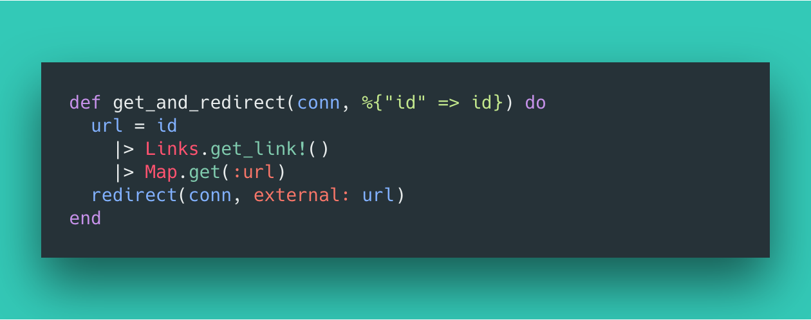

Let's start this month’s tutorial with two statements that are going to get me in trouble:

1.  Elixir is the most productive language out there.
2.  Bit.ly charges way much for their paid plan

Elixir, the Phoenix framework, and the Erlang VM allows us to make production ready systems fast, easily, and with very few moving parts. At this point, you can see where we’re going with this. Let’s use what comes out of the box with Elixir to create a link shortener and prevent a $500 monthly bill.

Let’s dive in!

### Initial Setup

#### Before you start

Please make sure you have the following:

1.  [Elixir](https://elixir-lang.org/install.html)
2.  [Phoenix](https://hexdocs.pm/phoenix/installation.html)

#### Create a new Phoenix Project

The first thing to do as always is to have Phoenix create the skeleton of the project. For this demo, we won't have a “frontend” so we can tell the initializer to leave those out.

In your terminal type:

```
mix phx.new shorten_api --no-html --no-brunch
```

#### Update your dependencies

Next, we're going to add a few dependencies to `mix.exs`. Go ahead and update the `deps/0` function in that file to look like this:

```elixir
# mix.exs

# ...
defp deps do
  [
    {:phoenix, "~> 1.3.2"},
    {:phoenix_pubsub, "~> 1.0"},
    {:phoenix_ecto, "~> 3.2"},
    {:postgrex, ">= 0.0.0"},
    {:gettext, "~> 0.11"},
    {:cowboy, "~> 1.0"},
    {:ecto_mnesia, "~> 0.9.1"}
  ]
end
# ...
```

### Logic!

Ok basic set up out of the way. That means we’re into setting up the logic that will:

1.  Allow us to save URLs
2.  Reference these URLs by a unique HashId (ex. `abc123`)
3.  Navigate to `/abc123` and it redirects to the URL that it references

First up, creating a way to store these links.

#### Creating a way to store these links

Let's use Phoenix’s built-in generators to do this for us. In your terminal run:

`mix phx.gen.json Links Link links hash:string:unique url:string:unique`

This will create the

1.  `Links` context
2.  `Link` model
3.  `Link` controller
4.  Database migration

That’s honestly the end of that step. It will ask you to put a few lines in your `router.ex` file but for now, you can skip that if you want as we will touch on it later. Let's move onto how we can modify what was created above to automatically create the id’s we will use to reference these links.

#### Autogenerate the HashId on Link creation

By default in these systems, models are given an `id` column in the database that is a number, unique and auto increments: 1, 2, 3 and so on. In our system we want the `id` to be a:

1.  Short
2.  Unique
3.  String
4.  That auto-generates.

_Ecto makes this really easy._

The first thing to do is make a custom Ecto Type which will handle all of this for us. Create a new file `shorten_api/ecto/hash_id.ex` and populate it as follows:

```elixir
# shorten_api/ecto/hash_id.ex
defmodule ShortenApi.Ecto.HashId do
  @behaviour Ecto.Type
  @hash_id_length 8
  # ======================= #
  # Ecto Specific Callbacks #
  # ======================= #

  @doc "Called when creating an Ecto.Changeset"
  @spec cast(any) :: Map.t
  def cast(value), do: hash_id_format(value)

  @doc "Converts/accepts a value that has been directly placed into the ecto struct after a changeset"
  @spec dump(any) :: Map.t
  def dump(value), do: hash_id_format(value)

  @doc "Converts a value from the database into the HashId type"
  @spec load(any) :: Map.t
  def load(value), do: hash_id_format(value)

  @doc "Callback invoked by autogenerate fields."
  @spec autogenerate() :: String.t
  def autogenerate, do: generate()

  @doc "The Ecto type."
  def type, do: :string

  # ============ #
  # Custom Logic #
  # ============ #

  @spec hash_id_format(any) :: Map.t
  def hash_id_format(value) do
    case validate_hash_id(value) do
      true -> {:ok, value}
      _ -> {:error, "'#{value}' is not a string"}
    end
  end

  @doc "Validate the given value as a string"
  def validate_hash_id(string) when is_binary(string), do: true
  def validate_hash_id(other), do: false

  @doc "Generates a HashId"
  @spec generate() :: String.t
  def generate do
    @hash_id_length
    |> :crypto.strong_rand_bytes()
    |> Base.url_encode64
    |> binary_part(0, @hash_id_length)
  end
end
```

Don’t worry if you don’t understand all of this, it’s a little more advanced…

What we did above is essentially create a new type that can be used the same way we define a field as a `String` or an `Integer`. Now we can define a field as a `HashId`.

> _You can learn more about this in the_ [_Ecto documentation_](https://hexdocs.pm/ecto/Ecto.Type.html)_._

So let's do just that and update `shorten_api/links/link.ex` to use a `HashId` as it’s a primary key instead of an `Integer`:

```elixir
# shorten_api/links/link.ex
defmodule ShortenApi.Links.Link do
  use Ecto.Schema
  import Ecto.Changeset
  alias ShortenApi.Ecto.HashId

  @primary_key {:hash, HashId, [autogenerate: true]}
  @derive {Phoenix.Param, key: :hash}
  schema "links" do
    field :url, :string

    timestamps()
  end

  @doc false
  def changeset(link, attrs) do
    link
    |> cast(attrs, [:url])
    |> validate_required([:url])
  end
end
```

Simple!

#### Update the migration

Now that the `HashId` is setup in our code, we want to update the migration to set up the database to reflect what's happening in our model file. You should have a file in your project that ends with `_create_links.exs` . Find it, open it and modify it to resemble the below code:

```elixir
# 20180806064709_create_links.exs
defmodule ShortenApi.Repo.Migrations.CreateLinks do
  use Ecto.Migration

  def change do
    create table(:links, primary_key: false) do
      add :hash, :string, primary_key: true
      add :url, :string

      timestamps()
    end

    create unique_index(:links, [:url])
  end
end
```

Note we are telling Ecto to use a different field as the primary key.

Alright, that's the majority of our plumbing steps, now we’re going to jump into the core logic of this whole project.

#### Redirect from an Id to a URL

First, we need a function in our controller that

1.  Takes an `Id` of a `Link`
2.  Looks up the `Link`
3.  Redirects to the `URL` attached to that `Link`

To do this, let's add a new function to our link controller found here: `shorten_api_web/controllers/link_controller.ex`
```elixir
# shorten_api_web/controllers/link_controller.ex
# ...

def get_and_redirect(conn, %{"id" => id}) do
  url = id
    |> Links.get_link!()
    |> Map.get(:url)
  redirect(conn, external: url)
end

# ...
```

Doesn’t Phoenix and Elixir make this so so pretty? 😍

#### Hook it all up to our router

Now that we have this new controller function, the only thing left is to hook it up. Update the `router.ex` file to reflect the following:

> Note: we will also be adding the routes to `mix phx.gen` suggested earlier

```elixir
# router.ex
defmodule ShortenApiWeb.Router do
  use ShortenApiWeb, :router

  pipeline :api do
    plug :accepts, ["json"]
  end

  scope "/api", ShortenApiWeb do
    pipe_through :api
    resources "/links", LinkController, except: [:edit]
  end

  scope "/", ShortenApiWeb do
    get "/:id", LinkController, :get_and_redirect
  end
end
```

### TADA! 🎉

At this point, you should be able to run the project with `mix phx.server` and have everything function as expected! However, we’re not stopping here.

### Secret sauce

Because link shorteners sit between a user and the actual content, it is crucial that these systems are fast. While Elixir is already fast, the main lag time in this process comes from our database. It takes time to look up the Link attached to an id.

To speed this up, link shorteners will often opt to use an in-memory datastore like Redis as opposed to an on-disk database like Postgres (which Phoenix sets us up with by default). **Thankfully because Elixir is built on top of the Erlang VM, we already have an in-memory datastore built in: Mnesia!**

In the next section, we’re going to alter our configuration to use Mnesia instead of Postgres.

#### Swapping from Postgres to Mnesia

This process is actually very simple. First update `config.exs` as shown:

```elixir
# config.exs
# ...
# Configure your database
config :shorten_api, ShortenApi.Repo,
  adapter: EctoMnesia.Adapter

config :ecto_mnesia,
  host: {:system, :atom, "MNESIA_HOST", Kernel.node()},
  storage_type: {:system, :atom, "MNESIA_STORAGE_TYPE", :disc_copies}

config :mnesia,
  dir: 'priv/data/mnesia'
# ...
```

#### Create your Mnesia database

Then create the location where Mnesia will back data up to and initialize the database through Ecto:

```bash
mkdir priv/data
mkdir priv/data/mnesia
mix ecto.create
mix ecto.migrate
```

**Boom done!** You’re now using an In-Memory database to hold our Link information. Wasn’t that easy?

### Kick it off

You now can

1.  start the project: `mix phx.server`

2. Create a shortened link via `curl`:

```bash
curl --request POST \
  --url http://localhost:4000/api/links/ \
  --header 'content-type: application/json' \
  --data '{
 "link": {
  "url": "https://twitter.com/bnchrch"
 }
}'
```

3. Take the `hash` returned in the response

`{“data”:{“url”:”[https://twitter.com/bnchrch](https://twitter.com/bnchrch)","hash":"7cJY_ckq"}}`

4. And be redirected appropriately when you go to `localhost:4000/{hash}`:


### Wrap up

Amazing how easy it was with all these tools to create a fast, easy to maintain and simple to extend link shortener. A lot of the credit here can go to the BEAM (Erlang VM), Jose Valim (creator of Elixir), and Chris McCord (creator of Phoenix). The rest of the praise goes to how simple the idea of a link shortener is, in no way justifying a $500 per month introductory price tag. Still looking at you Bit.ly.

#### 🧞‍ This is open source! you can [find it here on Github](https://github.com/bnchrch/shorten_api_tutorial)

#### ❤️ I only write about programming and remote work. If you [follow me on Twitter](https://www.twitter.com/bnchrch) I won’t waste your time.