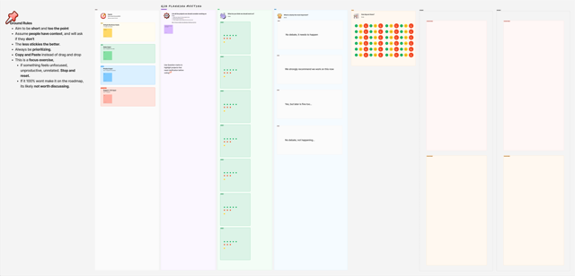

# Planning Cycles and aligning teams

Planning effectively is critical for engineering teams. The real challenge isn't figuring out what to build—it's making sure everyone understands why we're building it.

## The challenge of alignment

Each stakeholder brings unique priorities to the table:

- **Product teams** want new features
- **Engineering** needs technical improvements
- **Sales** seeks competitive advantages
- **Support** identifies customer pain points
- **Users** request specific enhancements

Without structure, some voices dominate while others fade. This creates disengagement and resistance.

## Why team understanding matters

The most successful planning cycles I've run share one crucial element: **everyone understands the why**. When team members grasp the reasoning behind decisions:

- They commit more deeply to the work
- They contribute more creative solutions
- They communicate more effectively with stakeholders
- They adapt better when challenges arise

Your team has the answers. The planning process should surface solutions from your team members first, not dictate them from above.

## A framework that centers team voices

I've built a planning framework that:

1. **Captures all perspectives** before forming opinions
2. **Surfaces team-generated solutions** rather than top-down directives
3. **Prioritizes collaboratively** using transparent criteria
4. **Creates psychological safety** for dissenting opinions
5. **Ensures everyone feels heard** even when their ideas aren't selected

The magic happens in facilitated sessions where team members lead the conversation, stakeholders listen before speaking, and everyone participates in ranking priorities.

## Outcomes that matter

This approach delivers tangible benefits:

- Engineers who can explain the "why" behind their work
- Team members who feel ownership over the direction
- Solutions that emerge from unexpected places
- Higher quality work through genuine buy-in
- Resilience when priorities need to shift

The process matters more than the template. When people feel heard, they'll support decisions even when they initially disagreed.

## Try it yourself

I've created a [Figma template](https://www.figma.com/board/1lDvUwdfp8Dl7SI8Wg8bdb/Quarterly-Planning-Template?node-id=0-1&t=Hx29DEiUIdkJJ49i-1) with the complete process.