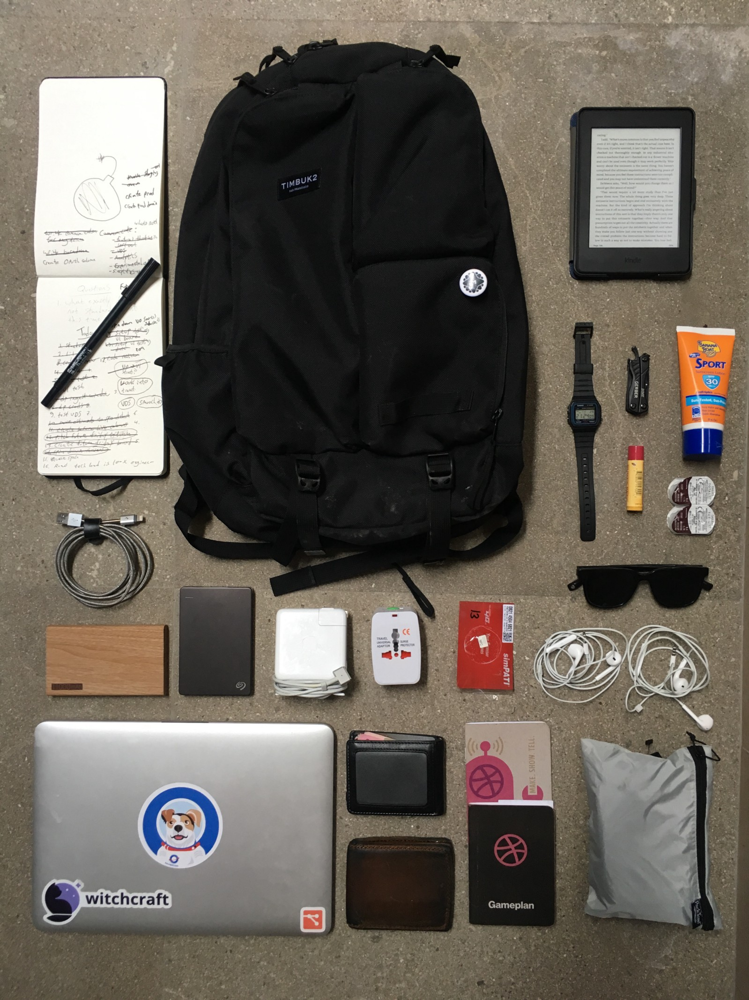
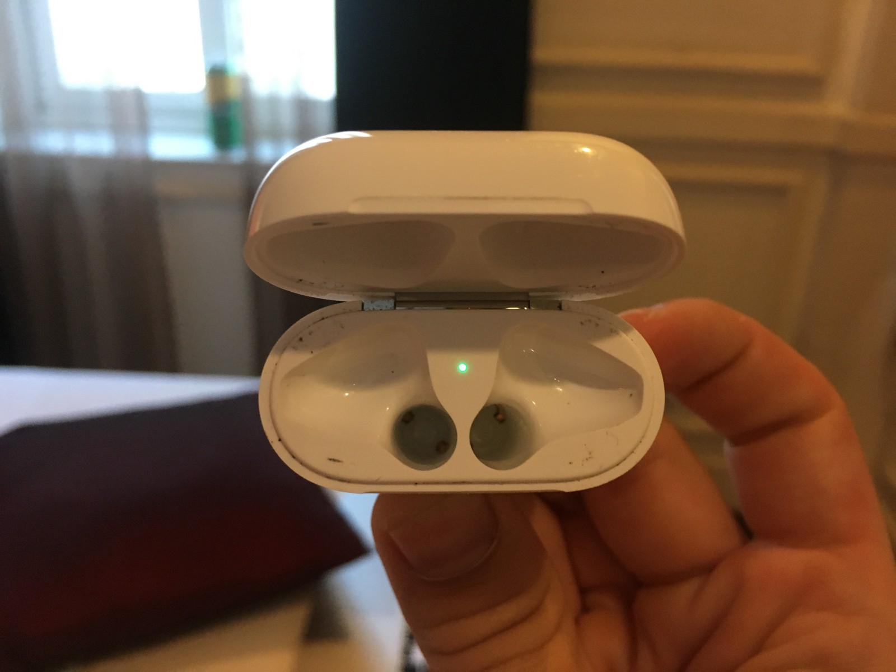
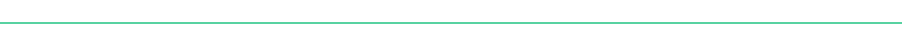

Not one to hide this opinion: **I am a huge fan of remote work!** I’m very vocal about my belief that this [trend towards more distributed workplaces has no choice but to continue](https://news.ycombinator.com/item?id=16945229). However I’m not naive enough to say that working remotely is perfect, it adds a whole new set of complications to your work day that you need to be prepared to handle.

> Remote work adds a whole new set of complications to your work day that you need to be prepared to handle 🎒

When your on the road either in your home city or one across the world it can be a challenge to:

1.  Stay connected.
2.  Be on track & on time.
3.  Stay clean & comfortable.

This is why I wanted to share what I typically keep in my bag. It should help keep you from learning the hard way, like I did.

### The Center’s of Attention

First: the items I use almost everyday, the Heavy Hitters.

#### The Bag

It’s not surprising that an article titled “What’s in my bag” has a blurb about the bag itself, so lets just get this out of the way.

You move around a lot when you’re remote: between places, between cafes, between traffic and more often than not from some where with shit wifi to slightly less shit wifi. So it’s important that you have a bag that is:

1.  Durable
2.  Comfortable
3.  Has pockets that are easy to access
4.  Low profile in size and weight
5.  But still has room for all your stuff and anything else you pickup between point A and Z

For this I went with [Timbuk2’s Showdown](https://amzn.to/2HNuPXA). Super happy with this bag, nothing more to say on it though, it fit the bill.

#### The Laptop

I’ve got a [Macbook Pro 13' (early 2015](https://amzn.to/2rkcwhE)) and I’m still in love ❤️.

I’ve never been secretive about my love for a bash terminal and an ecosystem that just works, nor for my dislike of the latest line of Macbook Pro’s (wheres that 32GB Apple?). With that in mind I believe that the early 2015 may be one of the greatest laptops ever made and [I’m not alone](https://marco.org/2017/11/14/best-laptop-ever) in that feeling. Outside of technical specs it particularly shines when travelling since the mag-safe adapter means:

-   I’m safe if someone trips over my cord in a coffee shop.
-   Someone will typically have a charger I can borrow in a pinch.
-   It’s built in cable management system makes packing a lot easier.

Grab one while you still can.

#### The Pen & Paper

Trying to keep a team happy, a project on track, and code going out the door can often feel like a juggling act. Then you add in the logistics of remote work and it becomes a circus. This is why [I write lists, lots of lists](https://medium.com/startup-frontier/why-i-make-lists-for-everything-24bfa36a01e1).

The simple act of writing out my list for the day, crossing items off and rearranging it for tomorrow using a pen with an old fashioned piece of paper is a great way to focus your mind on the task at hand. Lists also function as great book ends for your working day; allowing you to separate work from play.

> Lists also function as great book ends for your working day; allowing you to separate work from play. 🏖

Often people try to keep these in various To-Do apps; for whatever reason though I’ve been incapable of forming this habit, at least when its through a screen. So for this I typically will use an old fashion pen and paper to keep track of my life. Which is great because it’s something I don’t have to charge.

I’m also a big believer of investing in the tools you use often this is why my [notebook](https://amzn.to/2rkcwhE) and [pen](https://amzn.to/2JRtJX8) are little pricier than what you find at the dollar store. I find it makes my writing work with my thought rather than against it but to each their own!

#### The Books

It’s simple: reading lots is great! Lugging around lots to read, not so great! Before you embark anywhere do yourself a favour and grab a [Kindle](https://amzn.to/2FH5ys6), it will change your commute no matter how long.

_Special thanks to Michelle for the awesome present!_

### The Electronic Extra’s

These are the thing’s I keep around with the sole intention of staying charged, connected and ready if something unexpected should happen.

#### Travel Adapter

](./asset-2.png)

Every country is unique, unfortunately so are their power adapters. The trick here is to pack one that handles the largest number of outlets in the smallest size. I use [this one](https://amzn.to/2rjo7gY) and have been happy so far (though the ground….doesn’t actually seem like it works so YMMV).

#### Battery Pack

When remote you are often tethered to your phone, and when you’re not tethered you’re navigating and when you’re not navigating you’re either on a call, desperately trying to translate, taking pictures or looking up your flight confirmation. All of this is draining, battery and otherwise, the last thing you need is a dead battery complicating your next meeting or getting to your hotel. Keep a [battery pack](https://amzn.to/2w9N4Rr) handy to avoid this headache, trust me.

#### External SSD

A good SSD helps with 3 types of events:

1.  Entertainment for long flights and bus rides. _(Movies)_
2.  Broken or stolen laptop. _(Backups)_
3.  Running out of space. _(Life)_

Keep one with you on the road. I use a [1TB Seagate slim SSD](https://amzn.to/2wdfjPa), again no complaints here, pretty standard.

#### Heavy duty phone cable

I’ve mentioned that you should invest in the items you use often, I’ve also mentioned you’ll spend a lot of time charging your phone! Put the two together and you get a [high quality phone cable](https://amzn.to/2FHFzRc).

### The Essentials

These’ll help you handle the things life throws at you.

#### A Quick Dry Towel

Wet bike seats, Gym showers, Hot weather, weather in general and unexpectedly long layovers. Keeping a towel handy is good advice but hard to follow with your traditional piece of cloth. Pick up a [travel towel that packs light and dries quick](https://amzn.to/2rjHJlH).

#### A Cheap Watch

> Keep a watch on you set to 9am for whenever your work day needs to start, regardless of what the current time actually is. ⌚️

This is my favourite trick when working from a different time zone! Often you need to have overlap with your team, no matter if that means getting up at 4am local time. Keep a watch on you set to 9am for whenever your work day needs to start, regardless of what the current time actually is. It will save you the pain of having to wake up to the numbers 300 and trick your brain into getting onto the schedule you need. Bonus tips for keeping it water proof and cheap to save yourself from rogue waves or thieves. The [Casio](https://amzn.to/2rjdUB6) I use is perfect for this.

#### Sunglasses

Duh! 🕶

#### Pocket Tool

Grab a small multi-tool for your bag, its size to problem solving ratio is in your favour. I have the [Gerber Dime](https://amzn.to/2JRBVXE) but I’ve also used Leatherman’s Juice in the past and been happy!

#### Sunscreen, Lipchap, & Contacts

You can’t get good work done if you’re uncomfortable, travel is uncomfortable.

### Just In Case

#### Extra SIM Cards

Did I mention tethering? In most countries data is cheap but sometimes caps are low if you’re tethering all the time. Keep an extra sim handy in case one gives out on you. **Be wary of sim card merchants though, many will try and give you a down graded version of what you paid for, 3G when you asked for 4G, 1GB when you asked for 3.**

#### Extra Headphones

I’m prone to loosing things, travel increases the number of opportunities I have to do just this. I try to keep an extra set around because in a noisy coffee shop a meeting is impossible without your headphones.

#### Extra Notebooks

Good for if I forget my main notebook or it runs out of space.

#### Extra Wallets

**Ok this is the real secret!** I’ve been blessed to have grown up in a first world country; there’s a good chance if you’re reading this you have too. However outside of it you’re far likelier to encounter someone looking to rip you off, muggings, bribes or otherwise.

> Keep an extra wallet handy with a bit of petty cash, an empty prepaid credit card and a driver license 💸

Because of this I’ll often keep an extra wallet handy with a bit of petty cash, an empty prepaid credit card and a driver license. If I get into a bad situation I can typically use this to get out of loosing everything to someone looking to rip me off. **This typically pays off on most extended stays.**

### That’s it!

If I have any parting words it would be:

> Pack like me but don’t be like me because me, well he looses things.

> ❤️ If you like what you read [follow me on Twitter](https://twitter.com/bnchrch)

> 🐙 If your interested in development [follow me on Github](https://github.com/bechurch)

---

#### This story is published in [The Startup](https://medium.com/swlh), Medium’s largest entrepreneurship publication followed by 321,672+ people.

#### Subscribe to receive [our top stories here](http://growthsupply.com/the-startup-newsletter/).

