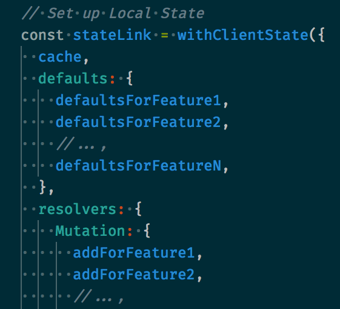
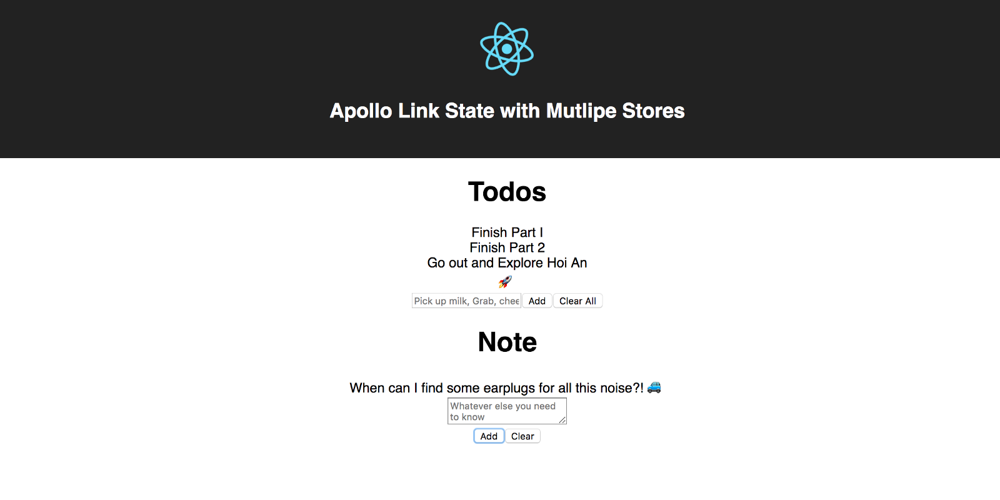

I want to touch on how to set up `apollo-link-state` to allow for support of multiple stores without interfering with one another.

In my last post we went over how to setup `apollo-link-state` for basic use:

[**Storing Local State in React with apollo-link-state**
_Special thanks to Peggy Rayzis for all the awesome work and communication that has been going out around this product._](/Storing-Local-State-in-React-with-apollo-link-state)

Now in this tutorial this is the moon we’re shooting for:

1.  Moving `withClientState` to its own file.
2.  Moving specific resolvers and mutations to their own files.
3.  Writting an elegant way to merge together multiple stores.
4.  Adding a new Notes feature to the previous demo.

Lets Dive in! 🚀🌙

### My biggest problem when using `apollo-link-state`

To kick this off I want to talk about the problem we are trying to solve.

It boils down to that `CreateClientState` expects only one value for `defaults` and one value for `Mutations.resolvers` which is incompatible if you have more than 1 object you want to store.



It’s incompatible because it forces us to keep the `resolvers` and `defaults` for multiple logically separate features in one place. OR if forces us to explicitly reference a `resolver`/`default` from a separate file every time we create one.

This is bad and in a medium to large app is a great way to make your logic hard to track.

### How can we solve this

Thankfully the solution to this is really easy! It involves the following:

#### 1\. Move `CreateClientStore out of` our `client.js file`

Move the configuration of your client store to its own file to help highlight that this is a very specific and a very important piece in our application.

Our new `client.js` should look like this:

```jsx
// client.js
import {InMemoryCache} from 'apollo-cache-inmemory';
import {ApolloLink} from 'apollo-client-preset';
import {ApolloClient} from 'apollo-client';
import CreateClientStore from './CreateClientStore';

// Set up Cache
const cache = new InMemoryCache();

// Set up Local State
const stateLink = CreateClientStore(cache);

// Initialize the Apollo Client
const Client = new ApolloClient({
  link: ApolloLink.from([
    stateLink,
  ]),
  cache: cache,
});

export default Client;
```

#### 2\. Move our defaults, resolvers, and `@client` queries to their own file

Break out the `defaults` and `resolvers` for a specific area of functionality into their own “store” files to help ensure as the application grows code is logically co-located.

```jsx
// TodoStore.js
import gql from 'graphql-tag';
import {graphql} from 'react-apollo';
import compose from 'recompose/compose';

/*
  Defaults
*/

const todoDefaults = {
  currentTodos: [],
};

/*
  GraphQL
*/

const todoQuery = gql`
  query GetTodo {
    currentTodos @client
  }
`;

const clearTodoQuery = gql`
  mutation clearTodo {
    clearTodo @client
  }
`;

const addTodoQuery = gql`
  mutation addTodo($item: String) {
    addTodo(item: $item) @client
  }
`;

/*
  Cache Mutations
*/

const addTodo = (_obj, {item}, {cache}) => {
  const query = todoQuery;
  // Read the todo's from the cache
  const {currentTodos} = cache.readQuery({query});

  // Add the item to the current todos
  const updatedTodos = currentTodos.concat(item);

  // Update the cached todos
  cache.writeQuery({query, data: {currentTodos: updatedTodos}});

  return null;
};

const clearTodo = (_obj, _args, {cache}) => {
  cache.writeQuery({query: todoQuery, data: todoDefaults});
  return null;
};

/*
  Store
*/

/**
 * The Store object used to construct
 * Apollo Link State's Client State
*/
const store = {
  defaults: todoDefaults,
  mutations: {
    addTodo,
    clearTodo,
  },
};

/*
  Helpers
*/

const todoQueryHandler = {
  props: ({ownProps, data: {currentTodos = []}}) => ({
    ...ownProps,
    currentTodos,
  }),
};

const withTodo = compose(
  graphql(todoQuery, todoQueryHandler),
  graphql(addTodoQuery, {name: 'addTodoMutation'}),
  graphql(clearTodoQuery, {name: 'clearTodoMutation'}),
);

export {
  store,
  withTodo,
};
```

#### 3\. Tie it together with some lodash magic 🧙‍

Finally we use some helpers from lodash to merge the export of each `store` file into one. This allows us to define `resolvers` and `defaults` in separate files and bring them back together during configuration.

_Look at the_ `_mergeGet_` _function specifically to see how this occurs._

```jsx
// CreateClientStore.js
import {store as todoStore} from './TodoState';
import {withClientState} from 'apollo-link-state';
import flow from 'lodash/fp/flow';
import assignIn from 'lodash/fp/assignIn';
import map from 'lodash/fp/map';
import reduce from 'lodash/fp/reduce';
const reduceWithDefault = reduce.convert({cap: false});

/**
 * At a given attribute this will merge all objects
 * in a list of objects found at that attribute.
 *
 * Example
 * const objectList = [
 *   {defaults: {x: true}},
 *   {defaults: {y: "foo"}},
 *   {defaults: {z: 123}}
 * ]
 *
 * // returns {x: true, y: "foo", z: 123}
 * mergeGet("defaults")(objectList)
 */
const mergeGet = (attributeName) => flow(
  // pick a single attribute from each object
  map(attributeName),
  // merge all values into a single object
  reduceWithDefault(assignIn, {})
);

/**
 * Local Data Stores
*/
const STORES = [
  todoStore,
];

/**
 * Map the Mutation handlers and Default Values of our local state to
 * the Apollo cache.
 */
const CreateClientStore = (cache) => {
  // Merge all defaults
  const defaults = mergeGet('defaults')(STORES);

  // Merge all mutations
  const mutations = mergeGet('mutations')(STORES);

  // Construct the Client State with the given mutations and defaults
  return withClientState({
    cache,
    defaults: defaults,
    resolvers: {
      /*
       * These mutations relate to graphql mutations with the @client decorator
       * by function name.
       */
      Mutation: mutations,
    },
  });
};

/**
 * Export
 */

export default CreateClientStore;
```

### Adding another feature becomes easy-peasy

Now that we have the above infrastructure in place adding a second feature is just as easy as adding the 100th feature.

Lets test out this statement by adding a Freeform notes field to the application.

#### 1\. Create the Notes Store

Nearly identical to the Todo Store above.

```jsx
// NoteStore.js
import gql from 'graphql-tag';
import {graphql} from 'react-apollo';
import compose from 'recompose/compose';

/*
  Defaults
*/

const noteDefaults = {
  savedNotes: "",
};

/*
  GraphQL
*/

const notesQuery = gql`
  query GetNotes {
    savedNotes @client
  }
`;

const clearNoteQuery = gql`
  mutation clearNote {
    clearNote @client
  }
`;

const updateNoteQuery = gql`
  mutation updateNote($text: String) {
    updateNote(text: $text) @client
  }
`;

/*
  Cache Mutations
*/

const updateNote = (_obj, {text}, {cache}) => {
  // Update the cache
  cache.writeQuery({query: notesQuery, data: {savedNotes: text}});

  return null;
};

const clearNote = (_obj, _args, {cache}) => {
  cache.writeQuery({query: notesQuery, data: noteDefaults});
  return null;
};

/*
  Store
*/

/**
 * The Store object used to construct
 * Apollo Link State's Client State
*/
const store = {
  defaults: noteDefaults,
  mutations: {
    updateNote,
    clearNote,
  },
};

/*
  Helpers
*/

const notesQueryHandler = {
  props: ({ownProps, data: {savedNotes = ""}}) => ({
    ...ownProps,
    savedNotes,
  }),
};

const withNotes = compose(
  graphql(notesQuery, notesQueryHandler),
  graphql(updateNoteQuery, {name: 'updateNoteMutation'}),
  graphql(clearNoteQuery, {name: 'clearNoteMutation'}),
);

export {
  store,
  withNotes,
};
```

#### 2\. Hook up the new Store

Import the new store into `CreateClientStore.js` and add it to our `STORES`.

```jsx
// CreateClientStore.js
import {store as noteStore} from './NoteStore';

// ...

/**
 * Local Data Stores
*/
const STORES = [
  todoStore,
  noteStore,
];
```

#### 3\. Create the Note Component

Now that we have the store created and wired in it’s time to put it all to use.

```jsx
// Notes.js
import React from 'react';
import compose from 'recompose/compose';
import withState from 'recompose/withState';

import {withNotes} from './NoteStore'

const NotesPure = ({
  savedNotes,
  updateNoteMutation,
  clearNoteMutation,
  noteText,
  setNoteText,
}) => (
  <div>
    <h1>Note</h1>
    <div>{savedNotes}</div>
    <div>
      <textarea
        value={noteText}
        onChange={(e) => setNoteText(e.target.value)}
        placeholder='Whatever else you need to know'
      />
    </div>
    <div>
      <input type='submit' value='Add' onClick={(e) => {
        updateNoteMutation({variables: {text: noteText}});
        setNoteText("")
      }} />
      <input type='submit' value='Clear' onClick={(e) => clearNoteMutation()} />
    </div>
  </div>);

const Notes = compose(
  withNotes,
  withState('noteText', 'setNoteText', ''),
)(NotesPure);

export default Notes;
```

#### 4\. Add to app.js

Finally add our new component to our `<App/>` container.

```jsx
// App.js
import React from 'react';

import TodoList from './TodoList'
import Notes from './Notes'

import logo from './logo.svg';
import './App.css';

const Header = () => (
  <header className="App-header">
    
    <h1 className="App-title">Apollo Link State with Mutlipe Stores</h1>
  </header>);

const App = () => (
  <div className="App">
    <Header/>
    <TodoList/>
    <Notes/>
  </div>
);

export default App;
```

### See it in action!

You should now be able to run the update demo and see our new note’s feature in action. Simple.



### Wrap up

I wanted to put this out because I think this Apollo’s version of maintaining local state has some real potential and as a young project the more support it gets the more we should see if grow and thrive.

Part of supporting a project is learning how to use it and learning how to improve on it. I hope this helps do both!

Happy coding!

> 🧞‍ This is open source! you can [find it here on Github](https://github.com/bechurch/link_state_demo)

> ❤️ **I only write about programming and remote work. If you** [**follow me on Twitter**](https://www.twitter.com/bnchrch) **I won’t waste your time.**