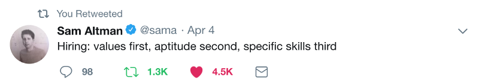

mention sam altman’s tweet

**TODO**

Talk about the hiring test at FuturePet

Talk about respecting time

Talk about making it small

talk about learning what they knew already

talk about who it filtered

talk about who you ended up with

talk about assumptions: this is biased, I dont know how their interest in a language would effect the out come

talk about choosing languages that dont have alot of tutorials out there

  

\*\***Convince**\*\*

My insight with hiring engineers and engineers in general is a great engineer’s defining characteristic isn’t the mastery of a given tool, it’s their mastery of learning.

**\*\*What to do\*\***

Don’t test for aptitude with python, test for aptitude with learning and with coding as an abstract.

**\*\*How to do it\*\***

1\. Talk with them and learn what languages they don’t know.

2\. Ask them to complete a small 1 hour max project in a language they don’t know

3\. Don’t give them guidance on what the criteria is other than “write quality code”

4\. Evaluate based on your definition of quality

5\. or use my definition.

**\*\*My definition of quality\*\***

1\. Is it easy to understand and read.

2\. Is it logically structured